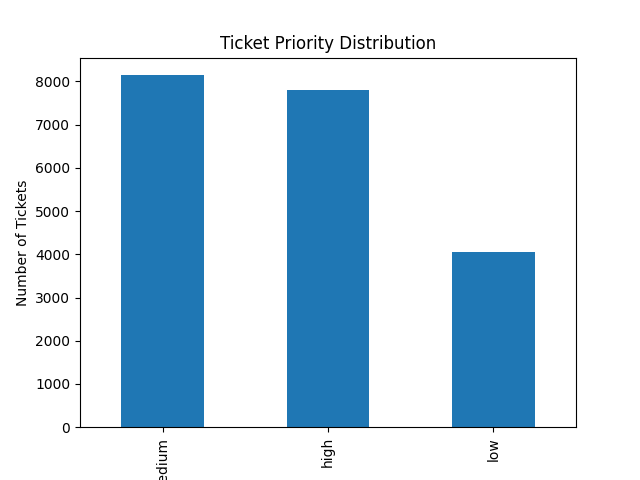
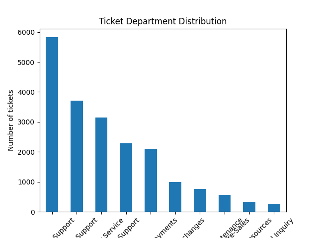
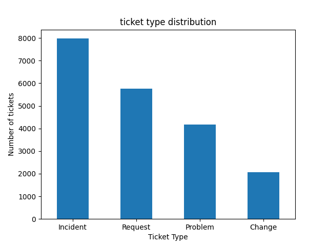
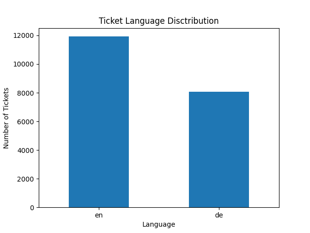

# Customer Operations Analytics

## 📌 Project Overview
This project analyzes 20K+ customer support tickets to derive operational insights related to workload distribution, ticket priorities, support queues, and customer segmentation.

## 🎯 Objective
- Understand operational workload across support teams
- Analyze ticket priority and issue types
- Generate dashboard-ready insights for operations management

## 🛠 Tools Used
- Python
- Pandas
- Matplotlib
- Jupyter Notebook

## 📊 Key Insights
- Medium and High priority tickets dominate workload
- Technical Support handles the highest volume of tickets
- Incident-type tickets are most common
- Customer support workload is multilingual (EN & DE)

## 📈 Visualizations

### Priority Distribution

### Queue Distribution

### Type Distribution

### Language Distribution

## 📂 Project Structures
.
├── app.py
├── data
│   ├── cleaned_data.csv
│   └── raw_data.csv
├── notebooks
│   └── customer_operations_analysis.ipynb
├── README.md
├── requirements.txt
└── visuals
    ├── language_distribution.png
    ├── priority_distribution.png
    ├── queue_distribution.png
    └── type_distribution.png
